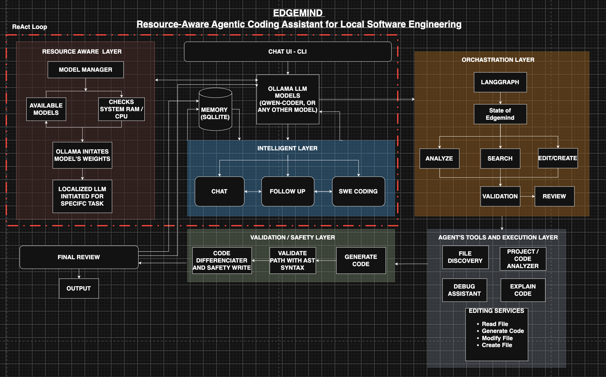

<div align="center">

# EdgeMind V1.0.3

## Resource-Aware Agentic Coding Assistant for Local AI Software Engineering

*"Building autonomous software engineering agents that run entirely on local consumer hardware."*

[](https://www.python.org)
[](https://github.com/langchain-ai/langgraph)
[](https://ollama.com)
[](https://www.sqlite.org)
[](LICENSE)
[](#-installation--setup)

</div>

---

## 📖 Problem Statement & Motivation

Modern AI coding assistants heavily rely on expensive cloud infrastructure, exposing proprietary code bases to third-party servers, incurring high latency, and requiring constant internet connectivity. Conversely, running autonomous coding agents locally on consumer hardware presents distinct challenges: limited system RAM, constrained compute, dynamic local model availability, and potential hallucinations or syntax errors.

**EdgeMind** resolves these challenges by combining:
- **Edge AI & Local Inference**: Powered by local Ollama LLMs with zero data leaving your machine.
- **Intent-Driven Dual Routing**: Distinguishes execution requests from conversational discussions and follow-ups.
- **Agentic LangGraph Workflows**: Multi-step graph orchestration with autonomous file discovery, structured planning, disk inspection, and retry recovery.
- **Resource-Aware Dynamic Model Router**: Automatically detects installed local models and matches tasks to available models without forcing unnecessary multi-GB downloads.
- **Hardened Multi-Layer Verification**: AST syntax parsing, atomic disk writes, path security boundaries, and automatic backup preservation.

---

## ✨ Core Features

- 🧠 **Context-Aware Intent Routing**: Automatically classifies queries into `EXECUTION` (graph workflow), `FOLLOW_UP` (read-only change explanation), or `CONVERSATIONAL` (pair-programming mode).
- ⚡ **Real-Time Activity Event Streaming**: Live progress events (`● Understanding request...`, `✓ Found bad.java`, `→ Analyze → Edit`, `✓ Syntax valid`) streamed directly to the CLI interface.
- 🤖 **Intelligent Local Model Manager**: Auto-discovers installed Ollama models (`qwen2.5-coder`, `codellama`, `deepseek-coder`, `phi3`, `llama3`), using available models without mandatory downloads.
- 🛠️ **Autonomous Code Creation & Modification**: Intelligently infers whether to create new files (e.g. `bad.java` → `bad.py`) or modify existing source files in-place.
- 🛡️ **Hardened Verification & Safety**: Disk-level post-write inspection, AST syntax validation, path traversal protection, and automatic backup directory isolation (`.edgemind/backups/`).
- 🗂️ **Enriched SQLite Session Memory**: Persists execution requests, plans, diffs, analysis findings, and verification results across interactive turns in `~/.edgemind/edgemind.db`.

---

## 🏗️ System Architecture



---

## 🤖 Model & Ollama Architecture

EdgeMind uses a resource-aware model manager and router ([`app/models/model_router.py`](file:///Users/akhi/EdgeMind/app/models/model_router.py)) that categorizes installed local Ollama models:

- **Coding Workloads** (`edit`, `modify`, `create`, `debug`, `deployment`): Dynamically routes to installed coding models matching `coder`, `code`, `starcoder`, `deepseek-coder`, `codellama`, or `qwen2.5-coder`. Fallback default: `qwen2.5-coder:3b`.
- **Conversational & Planning Workloads** (`planner`, `search`, `explain`, `conversational`, `follow_up`): Dynamically routes to installed general models matching `phi3`, `llama3`, `mistral`, `gemma`, or `qwen`. Fallback default: `phi3:mini`.
- **First-Run Resource Awareness**: Evaluates available system RAM via `psutil`. If no model is installed, recommends resource-appropriate fallbacks (`qwen2.5-coder:3b` for $\ge 4\text{ GB RAM}$) and prompts before pulling.

---

## 🗂️ Dual-Layer Memory Architecture

1. **Short-Term Session Context (`SessionState`)**: Tracks working directory, active file, active model, turn history, and pronoun references (`it`, `that`, `this file`) in-memory.
2. **Persistent SQLite Memory (`task_history`)**: Stored at `~/.edgemind/edgemind.db`. Records:
   - Project absolute path & query string
   - Executed plan JSON & tool task names
   - Source/target file paths & operation mode (`create` vs `modify`)
   - Truncated result output & generated unified diffs
   - Execution success and verification status

---

## 🛠️ Intelligent Code Editing & Safety Mechanisms

- **Edit Preview Generation**: `EditingService.prepare_edit()` generates modified code, parses AST/delimiters, and computes unified diffs before disk write.
- **Atomic File Writing**: `FileManager.write_file()` writes generated content to a temporary file in the target directory and replaces the destination atomically (`Path.replace()`), preserving file permission flags.
- **Security Path Traversal Boundary**: `validate_project_path()` rejects file operations outside project root boundaries or in forbidden directories (`.git`, `.venv`, `node_modules`).
- **Backup Isolation**: Automatically copies modified files into `.edgemind/backups/`, preserving relative directory hierarchy for instant rollback support.

---

## ⚙️ Installation & Setup

### Option 1: Install via PyPI

```bash
pip install edgemind
```

To upgrade an existing installation:

```bash
pip install -U edgemind
```

Launch the interactive CLI shell:

```bash
edgemind
```

---

### Option 2: Install from Source

```bash
git clone https://github.com/Akhilesh-Venkiteswaran/EdgeMind.git
cd EdgeMind
python3 -m venv venv
source venv/bin/activate
pip install -e .
```

---

## 🚀 Prerequisites & Model Setup

1. **Install Ollama**: Download from [https://ollama.com](https://ollama.com) and ensure `ollama` is in your system `PATH`.
2. **Start Ollama Daemon**:
   ```bash
   ollama serve
   ```
3. **Pull Recommended Local Model**:
   ```bash
   ollama pull qwen2.5-coder:3b
   ```

---

## 💡 Usage Examples

### Interactive CLI Shell

Launch the shell:
```bash
edgemind
```

#### Example 1: Code Conversion (File Creation)
```text
EdgeMind > Convert bad.java to Python
  ● Understanding request...
  ● Identifying source file...
  ✓ Found bad.java
  ● Determining requested operation...
  → Analyze → Edit
  ● Creating execution plan...
  ✓ 2 tasks planned
  ● Generating Python implementation...
  ✓ Generated bad.py
  ● Validating generated code...
  ✓ Python syntax valid
  ● Reviewing changes...
  ✓ Source preserved

Files Status:
  Created  : bad.py (NEW FILE)
  Modified : None
  Preserved: bad.java (UNTOUCHED)

Validation & Review:
  ✓ Source file preserved: /path/to/bad.java
  ✓ Target file created: /path/to/bad.py
  ✓ Syntax validation passed: Validation Passed
```

#### Example 2: Follow-Up Questions
```text
EdgeMind > What did you change?
  ● Understanding request...
  ● Loading previous execution context...
  ✓ Found 1 significant change.
  ● Reviewing the changes made...

EdgeMind:
I converted bad.java into bad.py:
- Transformed Java class structure into idiomatic Python functions.
- Converted standard I/O calls to native print statements.
- Added type hints and docstrings.
No additional files were modified.
```

#### Example 3: Single-Shot Subcommands
```bash
# Analyze project structure and resources
edgemind analyze .

# Explain a specific source file
edgemind explain app/models/model_router.py

# Analyze an error log or traceback
edgemind debug tests/sample_error.txt

# Generate Dockerfile
edgemind generate-docker .

# Generate requirements.txt
edgemind generate-requirements .

# Generate docker-compose.yml
edgemind generate-compose .
```

---

## 📂 Project Structure

```text
EdgeMind/
├── app/
│   ├── cli/             # Interactive shell, banner, commands, main Typer CLI
│   ├── editing/         # Editing service, file manager, modifier, validator, diffs
│   ├── events/          # Real-time activity streaming event system
│   ├── graph/           # LangGraph nodes, planner V2, state schema, workflow compilation
│   ├── memory/          # SQLite database schema, connections, memory manager
│   ├── models/          # Model manager, resource-aware router, Ollama client
│   ├── resources/       # System resource monitor (psutil CPU/RAM)
│   ├── routing/         # Intent router & conversational/follow-up handlers
│   ├── scripts/         # Graph export utilities
│   ├── setup/           # Prerequisites check & setup wizard
│   └── tools/           # Autonomous file discovery, scanner, analyzer, generators
├── tests/               # Unit, adversarial, agentic, and integration test suite
├── .github/workflows/   # CI/CD and automated PyPI release workflows
├── ARCHITECTURE.md      # Detailed system architecture blueprint
├── FUNCTION_REFERENCE.md# Complete technical function and class reference
├── WORKFLOWS.md         # Workflow sequence diagrams and call-flow documentation
└── pyproject.toml       # Package configuration & PyPI release metadata
```

---

## 🧪 Development & Testing

### Running Tests

Execute deterministic unit tests (no active Ollama server required):

```bash
pytest -m "not ollama" -v
```

Execute live Ollama integration tests:

```bash
pytest -m ollama -v
```

Execute complete test suite (all 40+ tests):

```bash
pytest -v
```

---

## 📦 Building Package & PyPI Release Infrastructure

EdgeMind utilizes standard Python setuptools packaging defined in `pyproject.toml`.

### Building Package Distribution
```bash
pip install build twine
python -m build
```

### PyPI Automated Release Workflow
Automated releases are managed via GitHub Actions ([`.github/workflows/release.yml`](file:///.github/workflows/release.yml)) using PyPI Trusted Publishing. Pushing a tag formatted `v*.*.*` automatically triggers build and publication to PyPI.

---

## ⚠️ Current Limitations

1. **Local Model Dependency**: Requires an installed local Ollama binary and at least one LLM model.
2. **Single-File Edit Scopes**: Active code modification step operates on one primary file per step; complex multi-file refactoring runs sequentially across graph steps.
3. **Language Syntax Checking**: AST-based syntax checking is fully deterministic for Python and JSON; structural delimiter checks are enforced for Java, C++, JS, and TS (with `node -c` invoked if Node.js is installed).

---

## 🗺️ Future Roadmap

- 🛠️ **Multi-File Simultaneous Refactoring**: Enhanced graph nodes for concurrent multi-file edit previewing.
- 🧪 **Automated Test Execution Node**: Native execution node for running `pytest` inside isolated sandbox containers.
- 📊 **Model Benchmarking Subsystem**: Automated benchmark suite evaluating local LLM accuracy across code edit tasks.

---

## 📜 License

MIT License. Free for open-source and commercial use.
