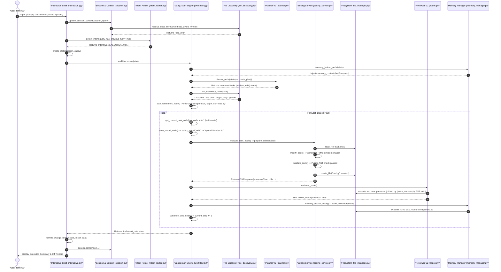
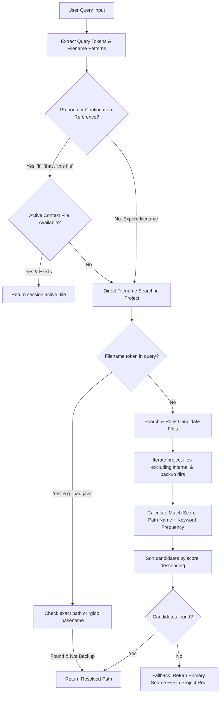
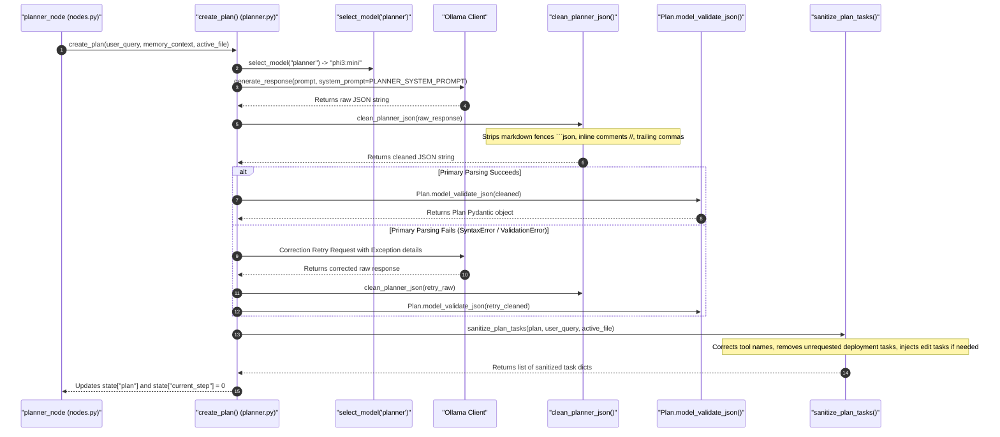
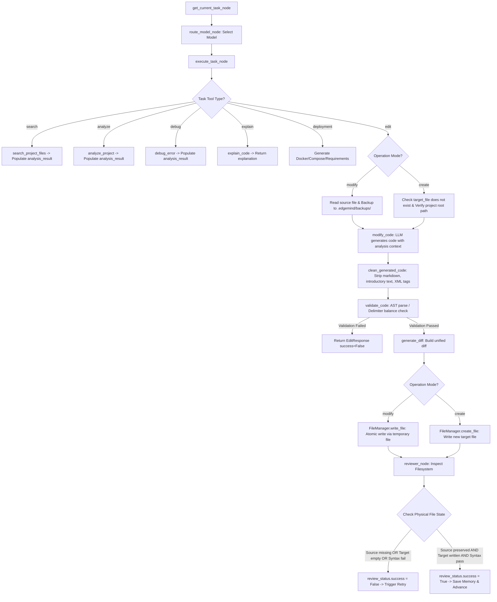
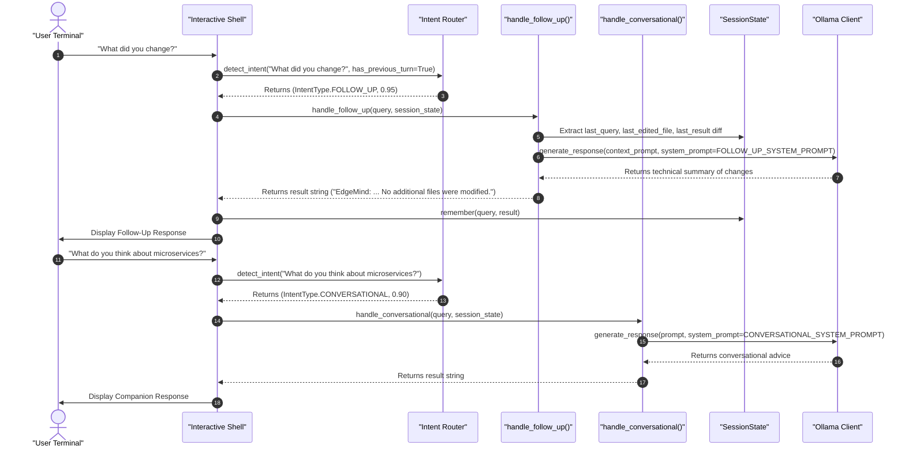
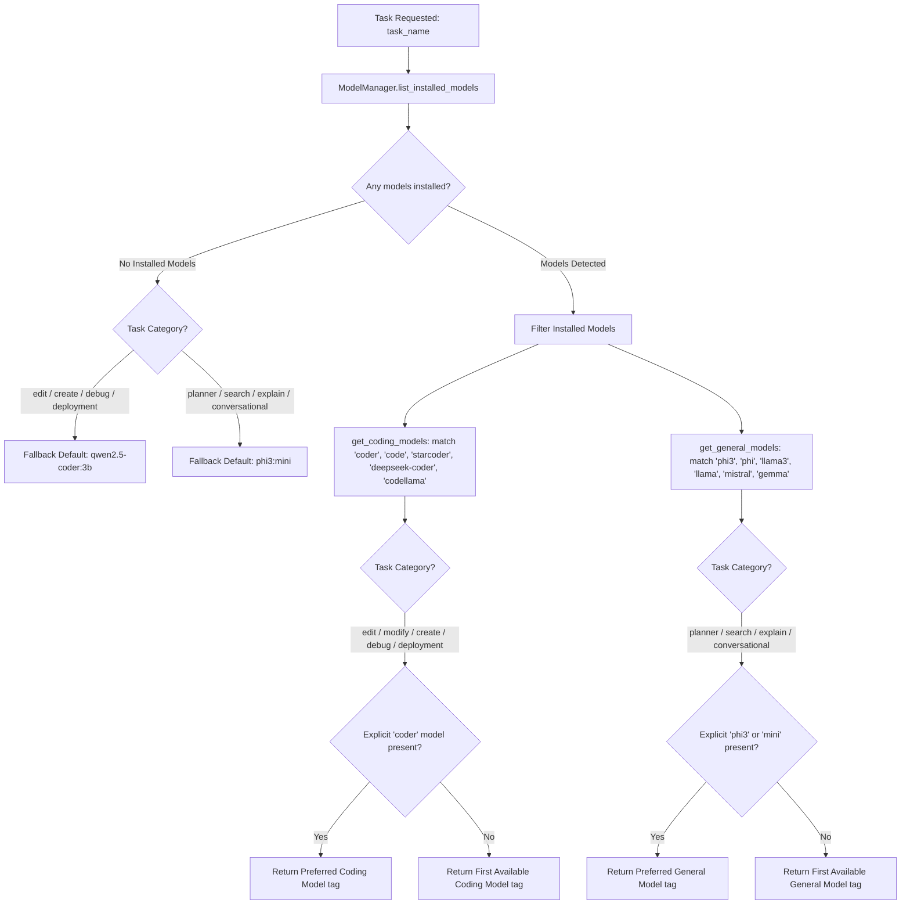
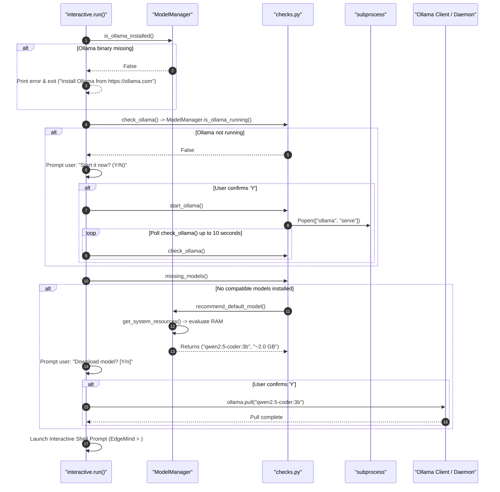
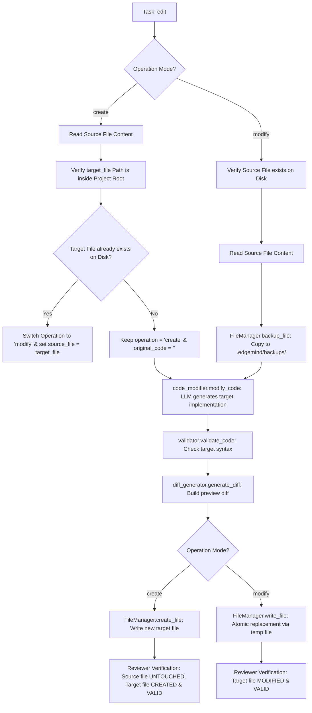
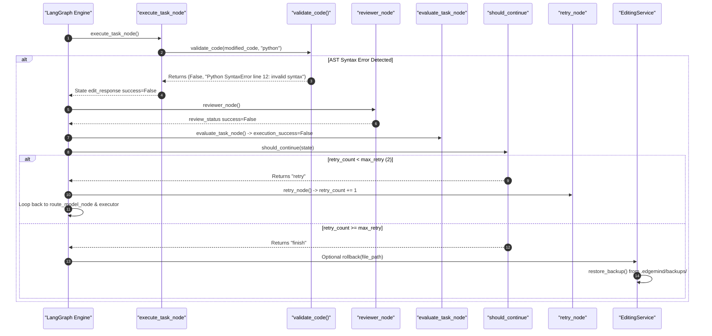

# EdgeMind Technical Workflows & Execution Call-Flow Documentation

This document traces the complete end-to-end call flows, state mutations, and component interactions across all primary operational workflows in EdgeMind V2.1.

---

## 1. Natural Language Coding Request Workflow

This workflow traces a natural-language request from terminal submission down to file modification, verification, and summary reporting.

---

## 2. Autonomous Project & File Discovery Workflow

When a user submits a query referencing code or files, EdgeMind autonomously discovers candidate files without requiring absolute paths.

### Discovery Verification Rules
1. **Security Isolation**: Files inside `.git`, `.edgemind`, `backups`, `__pycache__`, `.venv`, `venv`, `node_modules`, `build`, `dist`, `.pytest_cache` are strictly excluded.
2. **Backup Protection**: Files with `.bak` extensions are never selected for discovery.
3. **Pronoun Priority**: Pronouns (`"fix it"`, `"explain that"`) preserve the working `active_file` across turn boundaries.

---

## 3. Planner V2 → LangGraph Execution Call Flow

The Planner converts unstructured prompts into strict multi-step execution plans.

---

## 4. Analyze → Edit/Create → Validate → Review Pipeline

This workflow illustrates the complete editing and file creation lifecycle within the graph executor and reviewer nodes.

---

## 5. Conversational & Follow-Up Workflows (Read-Only)

Conversational inquiries bypass graph execution completely, eliminating unwanted file edits.

---

## 6. Resource-Aware Model Detection & Model Selection Workflow

EdgeMind dynamically selects installed local Ollama models based on task requirements and system hardware.

---

## 7. Ollama Startup & Model Setup Workflow

During interactive shell launch (`edgemind`), EdgeMind verifies local environment prerequisites.

---

## 8. File Creation vs In-Place Modification Workflow

EdgeMind distinguishes between modifying existing files in-place and creating new files (e.g. converting Java to Python).

---

## 9. Validation, Rollback & Recovery Workflow

If syntax validation or disk inspection fails, EdgeMind automatically executes recovery loops.

